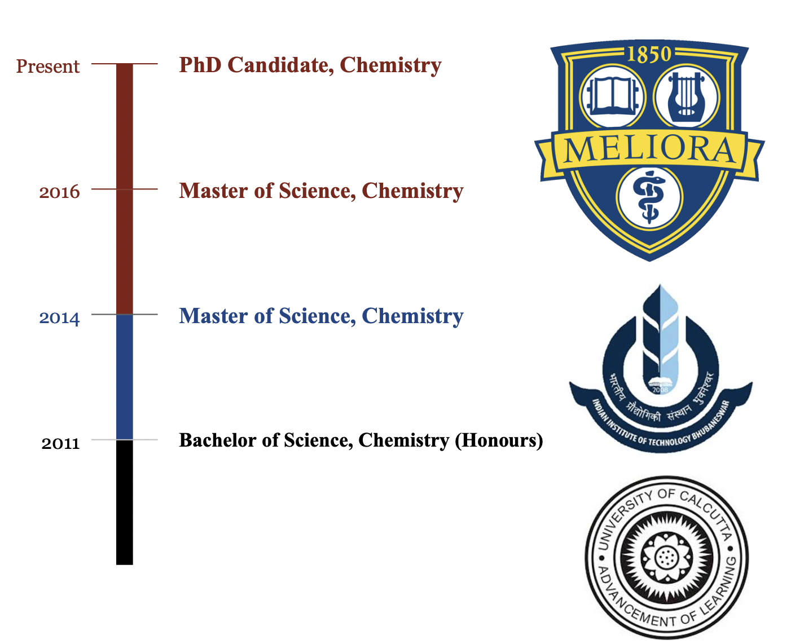
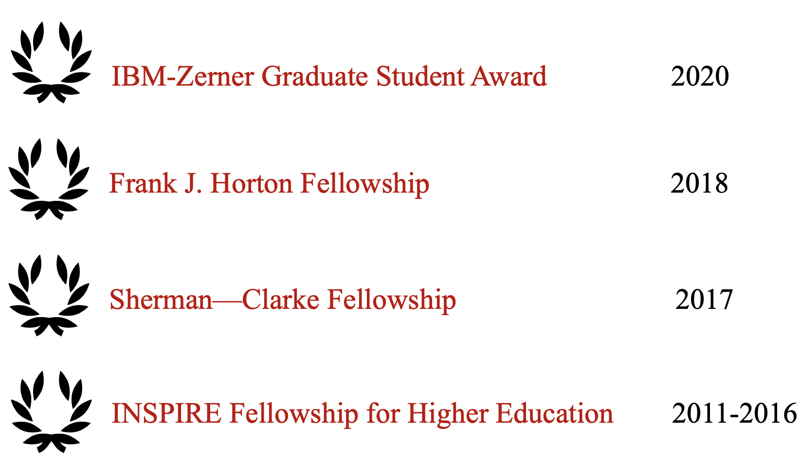
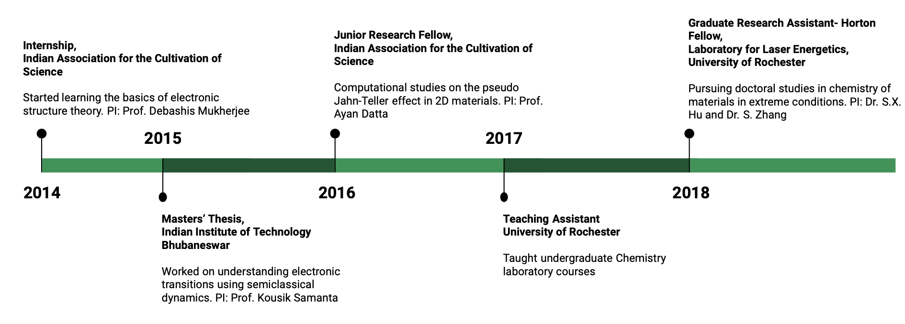

## Current Position

PhD Candidate, Department of Chemistry and Laboratory for Laser Energetics, University of Rochester.

## Education

`2019 - present`
__University of Rochester__
PhD Candidate in Chemistry

`2017 - 2019`
__University of Rochester__
Master of Science in Chemistry 

`2014 - 2016`
__Indian Institute of Technology (IIT) Bhubaneswar__
Master of Science in Chemistry 

`2011 - 2014`
__University of Calcutta__
Bachelor of Science in Chemistry 

## Awards

`2020`
IBM-Zerner Graduate Student Award, 60th Sanibel Symposium, University of Florida

`2018 - present`
Frank J. Horton Fellowship, Laboratory for Laser Energetics, University of Rochester

`2017`
Sherman-Clarke Scholarship, Department of Chemistry, University of Rochester

`2011`
INSPIRE Higher Education Award, Department of Science and Technology, India

## Employment History

`2017-present`
__Graduate Student__, University of Rochester

- Research assistant
- Teaching assistant

`2016-2017`
__Junior Research Fellow__, Indian Association for the Cultivation of Science

- Intern

